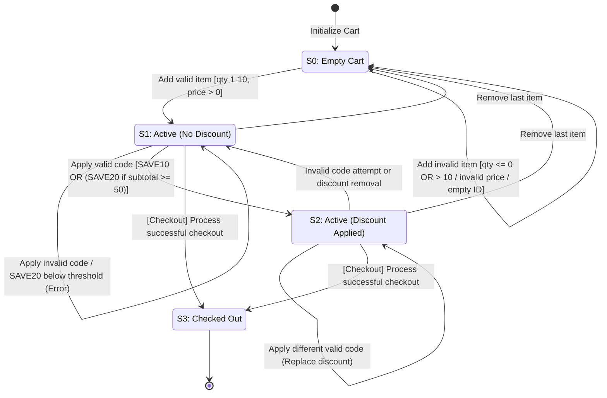

# Challenge 01 — Solution & QA Engineering Artifacts

This document contains the complete test analysis, structural models, test case specifications, and automation documentation for the **E-Commerce Shopping Cart Validation** technical challenge.

---

## 1. System State Transition Model

The lifecycle of the shopping cart is modeled across four primary states ($S_0$ through $S_3$), mapping valid transitions, reversal paths, and illegal actions.

---

## 2. Test Design: Decision Tables

### Table 1: Item Management Validation (Add / Remove)
Notation: T = True; F = False, * = Irrelevant; X = Action Executed; - = No Action

| **Conditions scenarios**                    | R01   | R02                | R03   | R04   | R05   | R06    | R07    |
| :--------------------------------------- | :---- | :----------------- | :---- | :---- | :---- | :----- | :----- |
| Operation Type                           | Add   | Add                | Add   | Add   | Add   | Remove | Remove |
| Product ID Present?                      | T     | T                  | T     | T     | F     | *      | *      |
| Qantity Input                            | 1-10  | <= 0 / non-integer | >10   | 1-10  | 1-10  | *      | *      |
| Price Input (>0)                         | T     | T                  | T     | F     | T     | *      | *      |
| Product Exists in Cart?                  | *     | *                  | *     | *     | *     | T      | F      |
| **<u>Actions</u>**                       |       |                    |       |       |       |        |        |
| Add Item & recalculate subtotal          | X     | -                  | -     | -     | -     | -      | -      |
| Remove Item & recalculate subtotal       | -     | -                  | -     | -     | -     | X      | -      |
| Error: "Invalid quantity"                | -     | X                  | -     | -     | -     | -      | -      |
| Error: "Quantity exceeds limit"          | -     | -                  | X     | -     | -     | -      | -      |
| Error: "Invalid price / missing product" | -     | -                  | -     | X     | X     | -      | -      |
| Error: "Item not found"                  | -     | -                  | -     | -     | -     | -      | X      |

---

### Table 2: Discount & Checkout Rules
Notation: T = True; F = False, * = Irrelevant; X = Action Executed; - = No Action

| Conditions scenarios                   | R08   | R09       | R10       | R11       | R12       | R13             | R14       | R15       |
| :------------------------------------- | :---- | :-------- | :-------- | :-------- | :-------- | :-------------- | :-------- | :-------- |
| Cart State                             | Empty | Non-Empty | Non-Empty | Non-Empty | Non-Empty | Non-Empty       | Non-Empty | Non-Empty |
| Discount Code Input                    | *     | SAVE10    | save10    | SAVE20    | SAVE20    | Invalid/Unknown | Empty     | *         |
| Current Subtotal                       | *     | *         | *         | >=50      | <50       | Any             | Any       | Any       |
| Prior Code Active?                     | *     | F         | T         | F         | *         | *               | *         | *         |
| Floor Condition (Subtotal - Disc <= 0) | *     | F         | F         | F         | -         | -               | -         | T         |
| Action: Checkout requested?            | T     | F         | F         | F         | F         | F               | F         | T         |
|  **<u>Actions</u>**                       |       |                    |       |       |       |        |        |
| Error "Cannot checkout empty cart"     | X     | -         | -         | -         | -         | -               | -         | -         |
| Apply 10% discount                     | -     | X         | X         | -         | -         | -               | -         | -         |
| Apply 20% discount                     | -     | -         | -         | X         | -         | -               | -         | -         |
| Replace existing code                  | -     | -         | X         | -         | -         | -               | -         | -         |
| Floor total at $0.00                   | -     | -         | -         | -         | -         | -               | -         | X         |
| Checkout succeeds (status: success)    | -     | -         | -         | -         | -         | -               | -         | X         |
| Error "Subtotal requirement not met"   | -     | -         | -         | -         | X         | -               | -         | -         |
| Error "Invalid code"                   | -     | -         | -         | -         | -         | X               | X         | -         |

---

## 3. Test Case Specification

| Id    | Ref rule | Description                                                                                                        | Inputs                                                                                                                                                                                                                  | Expected result                                                                                                                                                                     |
| :---- | :------- | :----------------------------------------------------------------------------------------------------------------- | :---------------------------------------------------------------------------------------------------------------------------------------------------------------------------------------------------------------------- | :---------------------------------------------------------------------------------------------------------------------------------------------------------------------------------- |
| TC01  | R01      | Add valid item to empty cart                                                                                       | productId: "p1", qty: 2,                                                                                                                                                                                                | Cart contains "p1", Subtotal = $50.00, Message: "Added p1", price: 25.00                                                                                                                                       
| TC02  | R02      | Add item to empty cart with invalid product Id                                                                     | productId: “”,                                                                                                                                                                                                          | Error ‘Missing product’; item is not added to cart, subtotal remains unchanged at $0  qty: 1,  price: 10                                                                                                                                          
| TC03a | R03      | Add valid item to empty cart with quantity as zero                                                                 | productId: 1,                                                                                                                                                                                                           | Error ‘Invalid quantity’; item is not added to cart, subtotal remains unchanged     qty: 0,                                                                                                                                                                     price: 10                                                                                                                                                                                                                                                                                                                                                                                                      
| TC03b | R03      | Add valid item to empty cart with negative quantity                                                                | productId: 1,                                                                                                                                                                                                           | Error ‘Invalid quantity’; item is not added to cart, subtotal remains unchanged     qty: -1,           price: 10                                                                                                                                                                                                                                                                                                                                                                                                      
| TC04  | R04      | Add valid product to empty cart with exceeding quantity limit                                                      | productId: 1,                                                                                                                                                                                                           | Error ‘Invalid quantity’; item is not added to cart, subtotal remains unchanged     qty: 11,     price: 10                                                                                                                                                                                                                                                                                                                                                                                                      
| TC05a | R05      | Add valid product to empty cart with valid quantity and negative price                                             | productId: 1,                                                                                                                                                                                                           | Error ‘Invalid price’; item is not added to cart, subtotal remains unchanged    qty: 5,       price: -3                                                                                                                                                                                                                                                                                                                                                                                                      
| TC05b | R05      | Add valid product to empty cart with valid quantity and price as 0                                                 | productId: 1,                                                                                                                                                                                                           | Error ‘Invalid price’; item is not added to cart, subtotal remains unchanged  qty: 5,                                                                                                                                                                                                                                                                price: 0                                                                                                                                                                                                                                                                                                                                                                                                       
| TC06  | R06      | Remove valid and existing product from cart                                                                        | Precondition: Cart contains productId: 1 (qty: 2, price: 10.00)       Action input: productId: 1                                                                                                                                                       | Cart does not contain productId: 1, subtotal updates to $0.00, message displays: "Removed 1"                                                                                        |                                                                                                                      
| TC07  | R07      | Remove invalid and non existing product from empty cart                                                            | Precondition: Cart is empty    Action input: productId: 99                                                                                                                                                                                                 | Error ‘Item not found’; cart state and subtotal remain unchanged                                                                                                                    |
| TC08  | R08      | Checkout empty cart                                                                                                | Precondition: Cart is empty      Action input: trigger checkout()                                                                                                                                                                                          | Error ‘Empty cart cannot be checked out’; cart state remains empty; checkout is blocked                                                                                             |
| TC09  | R09      | Apply valid uppercase discount code SAVE10                                                                         | Precondition: Cart contains items with a known subtotal (productId: 1, qty: 2, price: 50 -> subtotal: 100; no previous discount applied.     Action input: applyDiscount("SAVE10")                                                                                | Success message: ‘Applied SAVE10’; Discount of 10% is applied ($10.00); cart total updates to $90.00 (subtotal: 100.00, discount: 10.00, total: 90.00); active code set to "SAVE10" |
 | TC10  | R10      | Apply valid lowercase discount code save10                                                                         | Precondition: Cart contains items with a known subtotal (productId: 1, qty: 2, price: 50 -> subtotal: 100; no previous discount applied.        Action input: applyDiscount("save10")                                                                             | Success message: ‘Applied save10’; Discount of 10% is applied ($10.00); cart total updates to $90.00 (subtotal: 100.00, discount: 10.00, total: 90.00); active code set to "save10" |
| TC11  | R11      | Apply valid uppercase discount code SAVE20 with subtotal greater or equal to 50 with active previous discount code | Precondition: Cart contains items with subtotal $100.00; active discount code 'SAVE10' already applied (discount: $10.00, total: $90.00)        Action input: applyDiscount("SAVE20")                                                                               | Active code is replaced by 'SAVE20'; 20% discount applied ($20.00); total updates to $80.00 (not cumulative $30.00/total $70.00).                                                   |
| TC12  | R12      | Attempt to apply SAVE20 when subtotal is below the $50 threshold                                                   | Precondition: Cart contains items with a known subtotal (productId: 1, qty: 1, price: 49.99 -> subtotal: 49.99; no previous discount applied.     Action input: applyDiscount("SAVE20")                                                                                                                                                                                            | Error ‘Invalid discount for subtotal amount'; subtotal remains $49.99; discount remains $0.00; total remains $49.99; active code remains null/empty.                                |
| TC13  | R13      | Apply invalid uppercase discount code WHATEVER with subtotal equals to 50                                          | Precondition: Cart contains items with a known subtotal (productId: 1, qty: 1, price: 50 -> subtotal: 50; no previous discount applied.           Action input: applyDiscount("WHATEVER")                                                                                                                                                                                       | Error 'Invalid code'; subtotal remains $50.00; discount remains $0.00; total remains $50.00; active code remains null/empty.                                                        |
| TC14  | R14      | Verify cart total cannot be negative and floors at $0.00 when discount exceeds subtotal                            | Precondition: Cart has a subtotal less than the applied discount amount (e.g., mock cart state where subtotal = $10.00 and discount = $15.00, or discount applied then items removed reducing subtotal below discount)   Action input: Call cart.getTotal()   | Cart total evaluates to $0.00 (floored at 0, not -$5.00)
| TC15  | R15      | Verify checkout succeeds when cart is active                                                                       | Precondition: Cart has a productId: 1, qty: 1, price: 10. (subtotal: $10.00; discount: $0.00)  Action input: Call checkout()                                                                                                                                                                                                                                                       | Checkout succeeds with status "success"; final charged total equals $10.00; order confirmation returned; cart is finalized/cleared                                                  |                                                                                                                                                                                                                                                      
